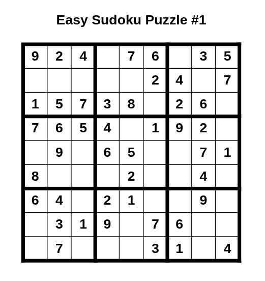

# Advanced Sudoku Puzzle Generator



A high-performance Sudoku puzzle generator written in Python that leverages multiprocessing to create professional-grade puzzles. Features customizable difficulty levels, symmetrical puzzle generation, and PDF output capabilities.

## Key Features

- 🎯 **Multiple Difficulty Levels**
  - Easy (40 clues default)
  - Medium (35 clues default)
  - Hard (30 clues default)
  - Professional mode with exact clue counts

- 🏗️ **Advanced Generation Capabilities**
  - Symmetrical puzzle generation for professional appearance
  - Guaranteed unique solutions
  - Configurable minimum clue counts
  - Multi-core processing for optimal performance

- 📄 **PDF Generation**
  - Clean, professional puzzle layouts
  - Optional solution PDF generation
  - Customizable output formatting
  - Multiple puzzles per PDF

## Technical Architecture

The generator is built around several key components:

- `PuzzleGenerator`: Core puzzle generation engine
- `AdvancedSudokuGenerator`: Professional-grade puzzle generator with symmetry
- `PDFGenerator`: PDF creation and formatting
- `ArgumentParser`: Command-line interface and configuration

## Requirements

- Python 3.x
- Dependencies:
  - numpy==2.1.1 (Grid management)
  - fpdf==1.7.2 (PDF generation)

## Installation

```bash
# Clone the repository
git clone https://github.com/JarnotMaciej/sudoku
cd sudoku

# Install dependencies
pip install -r requirements.txt
```

## Usage Guide

### Basic Command Structure

```bash
python sudoku.py -config <difficulty>:<count>:<clues> -output <filename.pdf> [options]
```

### Common Usage Patterns

1. **Generate Mixed Difficulty Puzzles**
```bash
python sudoku.py -config easy:5:40 -config hard:3:30 -output mixed.pdf
```

2. **Professional Hard Puzzles**
```bash
python sudoku.py -config hard:5:17 -output hard.pdf --use-symmetry --gen-answers
```

3. **Batch Generation with Default Clues**
```bash
python sudoku.py -config easy:10 -config medium:5 -output batch.pdf
```

### Command Line Options

- `-config`: Puzzle configuration (Format: difficulty:count:clues)
  - difficulty: easy, medium, hard
  - count: number of puzzles
  - clues: optional, defaults provided per difficulty
- `-output`: Output PDF filename
- `--gen-answers`: Generate solution PDF
- `--use-symmetry`: Enable symmetrical clue placement

## API Reference

### PuzzleGenerator
Core class for Sudoku puzzle generation.
```python
generator = PuzzleGenerator(size=9)
puzzle = generator.generate_sudoku(min_clues=30)
```

### AdvancedSudokuGenerator
Extended generator with professional features.
```python
advanced = AdvancedSudokuGenerator()
puzzle = advanced.generate_professional_sudoku(
    min_clues=17,
    symmetry=True,
    required_difficulty="hard"
)
```

## Development Setup

1. Clone the repository
2. Install development dependencies:
```bash
pip install -r requirements.txt
pip install -r test_requirements.txt
```
3. Run tests:
```bash
python -m pytest tests/
```

## Troubleshooting

1. **Slow Puzzle Generation**
   - Reduce the required difficulty level
   - Increase the minimum clue count
   - Check CPU core availability

2. **Memory Issues**
   - Reduce parallel puzzle generation count
   - Generate puzzles in smaller batches

3. **PDF Generation Errors**
   - Ensure write permissions in output directory
   - Verify valid output filename
   - Check available disk space

## Contributing

1. Fork the repository
2. Create a feature branch
3. Commit your changes
4. Push to the branch
5. Open a Pull Request

## License

This project is licensed under the MIT License.
